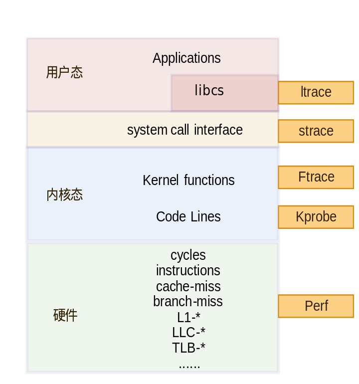

## 一、简介

ftrace(Function Trace)是一种调试工具，用于了解 Linux 内核中的情况



## 二、使用方式

### 内核配置

| 配置项                        | 说明                                        |
|-------------------------------|---------------------------------------------|
| `CONFIG_FTRACE=y`              | 启用了 Ftrace                               |
| `CONFIG_FUNCTION_TRACER=y`     | 启用函数级别的追踪器                        |
| `CONFIG_HAVE_FUNCTION_GRAPH_TRACER=y` | 表示内核支持图形显示                       |
| `CONFIG_FUNCTION_GRAPH_TRACER=y` | 以图形的方式显示函数追踪过程               |
| `CONFIG_STACK_TRACER=y`        | 启用堆栈追踪器，用于跟踪内核函数调用的堆栈信息。 |
| `CONFIG_DYNAMIC_FTRACE=y`      | 启用动态 Ftrace，允许在运行时启用和禁用 Ftrace 功能。 |
| `CONFIG_HAVE_FTRACE_NMI_ENTER=y` | 表示内核支持非屏蔽中断（NMI）时进入 Ftrace 的功能 |
| `CONFIG_HAVE_FTRACE_MCOUNT_RECORD=y` | 表示内核支持通过 mcount 记录函数调用关系。   |
| `CONFIG_FTRACE_NMI_ENTER=y`   | 表示内核支持通过 mcount 记录函数调用关系。   |
| `CONFIG_FTRACE_SYSCALLS=y`     | 系统调用的追踪                              |
| `CONFIG_FTRACE_MCOUNT_RECORD=y` | 启用 mcount 记录函数调用关系。              |
| `CONFIG_SCHED_TRACER=y`        | 支持调度追踪                                |
| `CONFIG_FUNCTION_PROFILER=y`   | 启用函数分析器，主要用于记录函数的执行时间和调用次数 |
| `CONFIG_DEBUG_FS=y`            | 启用 Debug 文件系统支持                    |

### Tracer种类

1. 函数类：function， function_graph， stack

2. 延时类：irqsoff， preemptoff， preemptirqsoff， wakeup， wakeup_rt， waktup_dl

3. 其他类：nop， mmiotrace， blk

### 挂载debugfs文件系统

ftrace基于debugfs调试文件系统，因此第一步需要先挂载debugfs.

```bash
# -t debugfs 表示挂载debugfs文件系统
# debugfs 是 Linux 内核提供的一个特殊的文件系统，用于调试和访问内核内部的状态。它提供了内核内部数据的可视化接口，允许用户访问诸如内核模块、进程、系统调用等的详细调试信息。
mount -t debugfs none /sys/kernel/debug
```

### /sys/kernel/debug/tracing下需要关注的目录

1. trace: 记录追踪的信息

    ```bash
    jvle@jvle-ThinkPad-X1-Carbon-Gen-8:~/Desktop/works/temp$ sudo cat /sys/kernel/debug/tracing/trace
    # tracer: nop
    #
    # entries-in-buffer/entries-written: 0/0   #P:8
    #
    #                                _-----=> irqs-off/BH-disabled
    #                               / _----=> need-resched
    #                              | / _---=> hardirq/softirq
    #                              || / _--=> preempt-depth
    #                              ||| / _-=> migrate-disable
    #                              |||| /     delay
    #           TASK-PID     CPU#  |||||  TIMESTAMP  FUNCTION
    #              | |         |   |||||     |         |
    ```

2. trace_pipe: 记录当前的追踪内容，但是堵塞的.

3. tracing_on: 向 tracing_on 写入 1，启用追踪；向 tracing_on 写入 0，停止追踪.

4. current_tracer： 表示当前启用的 tracer

    ```bash
    jvle@jvle-ThinkPad-X1-Carbon-Gen-8:~/Desktop/works/temp$ sudo cat /sys/kernel/debug/tracing/current_tracer
    nop
    ```
5. available_filter_functions: 可以被追踪的函数列表, 即可以写到 set_ftrace_filter，set_ftrace_notrace，set_graph_function，set_graph_notrace 文件的函数列表.

6. available_tracers: 当前编译到内核的 tracer 列表，也表示当前内核支持的tracer列表, 该列表的内容，就是可以写到 current_tracer 的 tracer 名.

    ```bash
    jvle@jvle-ThinkPad-X1-Carbon-Gen-8:~/Desktop/works/temp$ sudo cat /sys/kernel/debug/tracing/available_tracers
    timerlat osnoise hwlat blk mmiotrace function_graph wakeup_dl wakeup_rt wakeup function nop
    ```

7. buffer_size_kb: 记录 CPU buffer 的大小，单位为 KB.可通过写 buffer_size_kb 来改变 CPU buffer 的大小.

8. buffer_total_size_kb:  记录所有 CPU buffer 的总大小，即所有 CPU buffer 大小总和, 只读.

9. set_ftrace_filter: 过滤函数追踪，仅追踪写入该文件的函数名.

10. set_ftrace_notrace: 和 set_ftrace_filter 相反.

11. set_ftrace_pid: 对 set_ftrace_pid 文件中指定的 PID进程进行追踪.

### 常用命令

```bash
echo 0 > tracing_on         # 关闭trace
echo > trace                # 清空当前trace记录
cat available_tracers       # 查看当前支持的追踪类型
echo function_graph > current_tracer    # 设置当前的追踪类型
echo 1 > tracing_on         # 开启追踪
cat trace                   # 查看追踪结果
```

## 三、使用场景

### 追踪命令

重置trace

```bash
echo 0 > tracing_on
echo function > current_tracer 
```

追踪命令

```bash
echo > trace; echo $$ > set_ftrace_pid; echo 1 > tracing_on; `命令`; echo 0 > tracing_on
```

### 追踪函数的调用

```bash
echo 0 > tracing_on									# 关闭追踪器
cat available_filter_functions | grep "函数名"		# 搜索函数是否存在
echo 函数名 > set_ftrace_filter						# 设定追踪的函数
echo function > current_tracer						# 设置当前追踪类别
echo 1 > options/func_stack_trace					# 记录堆栈信息
echo > trace										# 清空缓存
echo 1 > tracing_on									# 开始追踪
```

### 追踪模块

需要在编译模块的时候加上 `-pg` 选项, 才能在 available_filter_functions 中找到函数.

## 四、ftrace的前端工具trace-cmd

使用 ftrace 并不是那么方便，我们需要手动的去控制多个文件, trace-cmd 能够非常方便的让我们进行 ftrace 的操作.

### 使用方式

1. 列出可用的追踪器

    ```bash
    jvle@jvle-ThinkPad-X1-Carbon-Gen-8:~/Desktop/works/temp$ sudo trace-cmd list -t
    timerlat osnoise hwlat blk mmiotrace function_graph wakeup_dl wakeup_rt wakeup function nop
    ```

2. 启用追踪器

```bash
jvle@jvle-ThinkPad-X1-Carbon-Gen-8:~/Desktop/works/temp$ sudo trace-cmd start -p function
  plugin 'function'
```

3. 查看追踪的输出

```bash
jvle@jvle-ThinkPad-X1-Carbon-Gen-8:~/Desktop/works/temp$ sudo trace-cmd show | head -20
# tracer: function
#
# entries-in-buffer/entries-written: 409860/168745290   #P:8
#
#                                _-----=> irqs-off/BH-disabled
#                               / _----=> need-resched
#                              | / _---=> hardirq/softirq
#                              || / _--=> preempt-depth
#                              ||| / _-=> migrate-disable
#                              |||| /     delay
#           TASK-PID     CPU#  |||||  TIMESTAMP  FUNCTION
#              | |         |   |||||     |         |
     clash-verge-2925    [001] d.h2.  5158.774913: update_min_vruntime <-update_curr
     clash-verge-2925    [001] d.h2.  5158.774913: __update_load_avg_se <-update_load_avg
     clash-verge-2925    [001] d.h2.  5158.774913: __update_load_avg_cfs_rq <-update_load_avg
     clash-verge-2925    [001] d.h2.  5158.774913: update_cfs_group <-task_tick_fair
     clash-verge-2925    [001] d.h2.  5158.774913: hrtimer_active <-task_tick_fair
     clash-verge-2925    [001] d.h2.  5158.774913: update_curr <-task_tick_fair
     clash-verge-2925    [001] d.h2.  5158.774914: update_curr_se <-update_curr
     clash-verge-2925    [001] d.h2.  5158.774914: __calc_delta.constprop.0 <-update_curr
```

4. 停止追踪

    ```bash
    trace-cmd stop
    ```

5. 清除缓冲区

    ```bash
    trace-cmd clear
    ```

6. 启用函数调用图追踪

    ```bash
    # 通过 --max-graph-depth 可以调整追踪深度
    trace-cmd start -p function_graph
    ```

## References

1. https://www.cnblogs.com/-Donge/p/17981595

2. https://source.android.com/docs/core/tests/debug/ftrace?hl=zh-cn

3. https://www.cnblogs.com/ArsenalfanInECNU/p/15667840.html

4. https://blog.csdn.net/weixin_38428439/article/details/121390679

5. https://linux.cn/article-13852-1.html