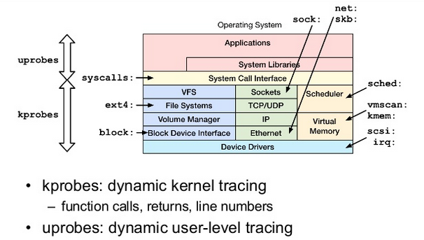
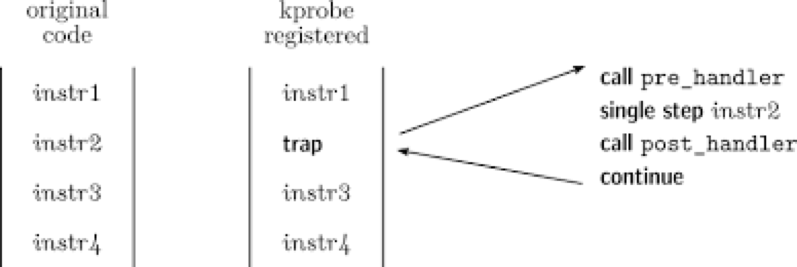

## 简介

kprobes/uprobes 机制在事件(events)的基础上分别为内核态和用户态提供了追踪调试的功能



## kprobe

kprobe的原理如图，用户可以自定义自己的回调函数，然后在函数中插入监测点.它提供了pre_handler、post_handler和fault_handler三种回调的方式.



## uprobe

uprobe是一种用户空间探针，uprobe探针允许在用户空间程序中动态插桩，插桩位置包括：函数入口、特定偏移处，以及函数返回处.

### 使用方式

#### 配置选项

在内核中启用 CONFIG_UPROBE_EVENTS=y 进行编译.

```bash
# 查看自己的内核是否配置
cat /boot/config-$(uname -r) | grep CONFIG_UPROBE_EVENTS
```

#### 前置工作

首先将需要监听的事件挂载, 挂载点为 `/sys/kernel/tracing/uprobe_events` 

挂载之后在相应的EVENT目录下会出现enable文件，使能events.

```bash
echo 1 > /sys/kernel/tracing/events/uprobes/<EVENT>/enable
```

#### 基本格式

- **设置 uprobe（用户空间探测）**：
    ```bash
    p[:[GRP/][EVENT]] PATH:OFFSET [FETCHARGS]
    ```

- **设置 uretprobe（用户空间返回探测）**
    ```bash
    r[:[GRP/][EVENT]] PATH:OFFSET [FETCHARGS]
    ```

- **设置返回探测（使用 %return）**
    ```bash
    p[:[GRP/][EVENT]] PATH:OFFSET%return [FETCHARGS]
    ```

- **清除探测**
    ```bash
    -:[GRP/][EVENT]
    ```

#### 参数说明

1. 概括

    - `GRP`（组名称）: 如果省略，默认值为 "uprobes".

    - `EVENT`（事件名称）: 如果省略，事件名称会根据 PATH 和 OFFSET 自动生成.

    - `PATH`（路径）: 可执行文件或库的路径.

    - `OFFSET`（偏移）: 探测点的偏移地址。对于 uretprobe，使用 OFFSET%return 设置返回探测的偏移.

    - `FETCHARGS`（参数）: 每个探测最多可以有128个参数，指定要获取的寄存器、内存、栈内容等.

2. `FETCHARGS`详细介绍

    -  一些常见的参数指定要获取的数据，包括寄存器、内存、栈等：

        - %REG: 获取寄存器 REG 的值.
        - @ADDR: 从用户空间的 ADDR 读取数据.
        - @+OFFSET: 从当前文件的 OFFSET 偏移位置读取数据.
        - $stackN: 获取栈中的第 N 个条目.
        - $stack: 获取栈的地址.
        - $retval: 获取函数返回值（仅用于 uretprobe）.
        - $comm: 获取当前任务的进程名称.
        - +|-OFFS(FETCHARG): 根据偏移量访问 FETCHARG 数据，适用于结构体字段.

    - 支持的类型包括：

        - 基本类型：u8/u16/u32/u64/s8/s16/s32/s64
        - 十六进制类型：x8/x16/x32/x64
        - 字符串类型：string
        - 位域类型

    s表示有符号类型, u, x表示无符号类型，但是x以十六进制显示. string用来从用户空间读取以 null 终止 的字符串. 位域的语法格式为`b<bit-width>@<bit-offset>/<container-size>`, 例如b8@16/32.

    - bit-width：字段的宽度，以位为单位.
    - bit-offset：字段的偏移量，表示从哪个位开始.
    - container-size：包含位域的容器大小，通常为 32 位.

## References

### General

1. http://yoc.docs.t-head.cn/linuxbook/Chapter4/tracing.html

### Kprobe

1. https://docs.kernel.org/trace/kprobes.html

### Uprobe

1. https://docs.kernel.org/trace/uprobetracer.html

2. https://blog.yanjingang.com/?p=8100