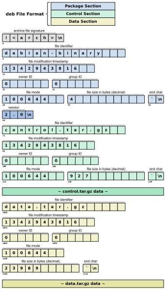

## 简介

库文件，其等价为一个归档(ar)文件，该文件内部通常包含不止一个目标文件. 每个目标文件存储的代码，并非完整的程序，而是一个个实用的功能模块.

GCC下，静态库文件名为lib*.a，在使用了其中的函数之后，使用-l*参数要求连接器连入. 例如，在许多系统上，当使用了math.h中的函数后，需要使用-lm参数连接libm.a文件.

Visual C++下，静态库文件名为*.lib，在使用了其中的函数之后，使用#pragma comment(lib,"*")预编译指令要求连接器连入.

## 归档文件的格式

归档文件的开头为为 `!<arch>` 和换行符（0x0A）. 这里根据不同的标准可能的格式情况不一致. 这里拿Debian的.deb为例.



通俗来讲归档文件的内容是这样的.

```bash
# [!<arch>\n][section1][section2][section3]...
# [section<n>] -> [ArHdr][content]
```

### 文件头(ArHdr)

| 偏移 | 长度 | 名称           | 各式   |
|------|------|----------------|--------|
| 0    | 16   | 文件标识符     | ASCII  |
| 16   | 12   | 文件修改时间   | 十进制 |
| 28   | 6    | 所有者ID       | 十进制 |
| 34   | 6    | 组ID           | 十进制 |
| 40   | 8    | 文件模式       | 八进制 |
| 48   | 10   | 文件大小字节数 | 十进制 |
| 58   | 2    | 结束字符       | 0x60 0x0A |

每个文件从偶数字节开始，如果长度为奇数，则需要填充一个换行符，文件头中的文件大小存储是实际大小.

## 静态库的制作和使用

### 静态库的制作

1. 在Linux下，首先通过gcc或者clang等工具将源码编译为目标文件(.o)，例如example1.o example2.o

2. 使用 ar 打包目标文件生成静态库(格式为lib`<name>`.a)

    ```bash
    # r: 表示将目标文件插入库中
    # c: 表示创建一个新的库文件
    # s: 表示创建索引
    ar rcs libexample.a example1.o example2.o
    ```

3. 可以查看归档文件的内容, 这将列出库文件中包含的所有目标文件（.o 文件）.

    ```bash
    ar t libexample.a
    ```

### 静态库的使用

```bash
gcc main.c -L. -lexample -o main
```

## 文件头的变体

“变体”指的是同一种工具或标准的不同实现版本，它们可能在功能、性能、接口等方面有所不同。以 ar 工具为例，不同操作系统或不同版本的 ar 工具实现了不同的方式来处理归档文件（即压缩文件、库文件等）.

在Linux下ar文件的变体为: System V.这个版本的 ar 在文件名的处理上就更加智能，采用了不同的方式，比如用 / 来标记文件名结束，支持文件名中有空格.

### System V 变体

通常 `"//"` 是第二个条目，符号表为第一个条目.

1. 用 "/" 文件名表示对应的数据为符号查找表，包含三部分，并存储为连续的数据.
    - 一个32位整数，大端存储：符号表的条目数.
    - 一组32位整数，大端存储：每个表示该符号在归档中的位置.
    - 一组字符串，0结尾：符号名称.

2. 用字符'/'（0x2F）标记文件名结束，从而文件名可以使用空格.

3. 为解决4GiB文件限制，某些系统如Solaris 11.2 和 GNU使用不同的查找表。不同之处在于使用64位整数和用`"/SYM64/"`代替`"/"`.

这里对该类文件举例.

```bash
# 举例
/
00000002
00000064
000000C8
symbol1
symbol2
//
file with spaces.c
/file1.c
00000032
FILE_DATA: ...
```

## References

1. wiki静态链接库: https://zh.wikipedia.org/wiki/%E9%9D%99%E6%80%81%E5%BA%93

2. wiki归档工具ar: https://zh.wikipedia.org/wiki/Ar_(Unix)