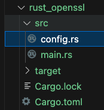

**代码结构**    

  

**-- config.rs 主要的功能模块实现**
```rust
// config.rs
use elf::endian::AnyEndian;
use elf::ElfStream;
use elf::ParseError;
use glob::glob;
use log::{error, info, warn};
use regex::bytes::Regex;
use std::fmt;
use std::fs::{self, File};
use std::io::{self, BufRead, BufReader, Read};
use std::path::{Path, PathBuf};
use std::str;

const LD_LOAD_PATH: &str = "/etc/ld.so.conf";
const DEFAULT_SO_PATHS: [&str; 4] = ["/lib", "/usr/lib", "/usr/lib64", "/lib64"];
const OPENSSL_VERSION_REGEX: &str = r"(OpenSSL\s\d\.\d\.[0-9a-z]+)";
const OPENSSL_VERSION_LEN: usize = 30; // This value can be adjusted based on the actual buffer length
                                       //const DEFAULT_IFNAME: &str = "eth0";
const LIBSSL_SHARED_OBJECTS: [&str; 2] = ["libssl.so.3", "libssl.so.1.1"];

#[derive(Debug)]
pub enum OpensslProbeError {
    Io(io::Error),
    ElfParseError(ParseError),
    UnsupportedArchitecture(String),
    SectionNotFound,
    VersionNotFound,
    RegexError(regex::Error),
}

impl From<io::Error> for OpensslProbeError {
    fn from(err: io::Error) -> Self {
        OpensslProbeError::Io(err)
    }
}

impl From<ParseError> for OpensslProbeError {
    fn from(err: ParseError) -> Self {
        OpensslProbeError::ElfParseError(err)
    }
}

impl From<regex::Error> for OpensslProbeError {
    fn from(err: regex::Error) -> Self {
        OpensslProbeError::RegexError(err)
    }
}

impl fmt::Display for OpensslProbeError {
    fn fmt(&self, f: &mut fmt::Formatter<'_>) -> fmt::Result {
        match self {
            OpensslProbeError::Io(e) => write!(f, "IO error: {}", e),
            OpensslProbeError::ElfParseError(e) => write!(f, "ELF parsing error: {}", e),
            OpensslProbeError::UnsupportedArchitecture(a) => {
                write!(f, "Unsupported architecture: {}", a)
            }
            OpensslProbeError::SectionNotFound => write!(f, "Section not found"),
            OpensslProbeError::VersionNotFound => write!(f, "Version not found"),
            OpensslProbeError::RegexError(e) => write!(f, "Regex error: {}", e),
        }
    }
}

#[derive(Debug)]
pub struct OpensslConfig {
    pub so_path: String,
    pub so_file: String,
    pub ssl_version: String,
}

impl OpensslConfig {
    pub fn new() -> OpensslConfig {
        OpensslConfig {
            so_path: String::new(),
            so_file: String::new(),
            ssl_version: String::new(),
        }
    }

    // Check OpenSSL configuration, looking for `libssl.so`
    pub fn check_openssl(&mut self) -> Result<(), OpensslProbeError> {
        let so_load_paths = Self::get_dyn_lib_dirs();
        for so_path_entry in so_load_paths {
            for &so_file in &LIBSSL_SHARED_OBJECTS {
                let ssl_path = Path::new(&so_path_entry).join(so_file);
                if ssl_path.exists() {
                    self.so_file = so_file.to_string();
                    self.so_path = ssl_path.to_string_lossy().to_string();
                    return Ok(());
                }
            }
        }
        Err(OpensslProbeError::Io(io::Error::new(
            io::ErrorKind::NotFound,
            "Unable to find OpenSSL library",
        )))
    }

    /// Reads and parses dynamic library configuration files based on the given pattern
    /// and returns a list of directories found in them (or an error).
    fn parse_dyn_lib_conf(pattern: &str) -> Result<Vec<String>, OpensslProbeError> {
        let mut dirs = Vec::new();
        let files = glob(pattern).map_err(|e| {
            OpensslProbeError::Io(io::Error::new(
                io::ErrorKind::Other,
                format!("Error collecting files: {}", e),
            ))
        })?;

        for file in files {
            let config_file = file.map_err(|e| {
                OpensslProbeError::Io(io::Error::new(
                    io::ErrorKind::Other,
                    format!("Error collecting files: {}", e),
                ))
            })?;
            let configfile = config_file.to_string_lossy();
            if configfile.contains("lib32") {
                continue;
            }

            let file = fs::File::open(&config_file).map_err(|e| OpensslProbeError::Io(e))?;
            let reader = BufReader::new(file);

            for line in reader.lines() {
                let line = line.map_err(|e| OpensslProbeError::Io(e))?;
                let line = line.trim();

                // Ignore comments and empty lines
                if line.is_empty() || line.starts_with('#') || line.starts_with(';') {
                    continue;
                }

                // Found "include" directive
                let words: Vec<&str> = line.split_whitespace().collect();
                if words
                    .get(0)
                    .map_or(false, |&word| word.to_lowercase() == "include")
                {
                    if let Some(subdirs) = Self::parse_dyn_lib_conf(words[1].trim()).ok() {
                        dirs.extend(subdirs);
                    }
                } else {
                    dirs.push(line.to_string());
                }
            }
        }

        if dirs.is_empty() {
            Err(OpensslProbeError::Io(io::Error::new(
                io::ErrorKind::Other,
                format!("read keylogger :{} error.", pattern),
            )))
        } else {
            Ok(dirs)
        }
    }

    /// Returns the list of directories to search for dynamic libraries,
    /// either from the configuration or a default list.
    fn get_dyn_lib_dirs() -> Vec<String> {
        match Self::parse_dyn_lib_conf(LD_LOAD_PATH) {
            Ok(mut dirs) => {
                dirs.push("/lib64".to_string());
                dirs.push("/usr/lib64".to_string());
                dirs
            }
            Err(_) => DEFAULT_SO_PATHS
                .iter()
                .map(|&path| path.to_string())
                .collect(),
        }
    }
    pub fn detect_openssl(&mut self, so_path: &str) -> Result<String, OpensslProbeError> {
        // Open file
        let mut f = File::open(so_path).map_err(OpensslProbeError::Io)?;

        // Read file contents into byte array
        let buffer = {
            let mut buffer = Vec::new();
            f.read_to_end(&mut buffer).map_err(OpensslProbeError::Io)?;
            buffer
        };

        // Parsing ELF files
        let mut elf_file: ElfStream<AnyEndian, &mut File> =
            ElfStream::open_stream(&mut f).map_err(OpensslProbeError::ElfParseError)?;
        // Check machine
        match elf_file.ehdr.e_machine {
            elf::abi::EM_X86_64 | elf::abi::EM_AARCH64 => {}
            _ => {
                return Err(OpensslProbeError::UnsupportedArchitecture(format!(
                    "Unsupported arch library, ELF Header Machine is: {:?}",
                    elf_file.ehdr.e_machine
                )));
            }
        }

        // Find the .rodata section
        let rodata_section = elf_file
            .section_header_by_name(".rodata")
            .map_err(OpensslProbeError::ElfParseError)?
            .ok_or(OpensslProbeError::SectionNotFound)?;

        let section_offset = rodata_section.sh_offset as usize;
        let section_size = rodata_section.sh_size as usize;

        // Find OpenSSL version using regular expression
        let rex = Regex::new(OPENSSL_VERSION_REGEX).map_err(OpensslProbeError::RegexError)?;
        let mut buf = vec![0u8; 1024 * 1024]; // 1MB 缓冲区
        let mut total_read_count = 0;
        let mut version_key = String::new();

        while total_read_count < section_size {
            let read_count = (&buffer[section_offset + total_read_count..])
                .read(&mut buf)
                .map_err(OpensslProbeError::Io)?;
            if read_count == 0 {
                break;
            }

            if let Some(match_version) = rex.find(&buf[0..read_count]) {
                let version_str = std::str::from_utf8(match_version.as_bytes()).map_err(|_| {
                    OpensslProbeError::Io(io::Error::new(
                        io::ErrorKind::InvalidData,
                        "Invalid UTF-8 sequence in matched version",
                    ))
                })?;
                version_key = version_str.to_string();
                break;
            }

            total_read_count += read_count.saturating_sub(OPENSSL_VERSION_LEN);
        }

        if version_key.is_empty() {
            return Err(OpensslProbeError::VersionNotFound);
        }

        self.ssl_version = version_key.clone();
        Ok(version_key.to_lowercase())
    }

    pub fn detect_openssl2(&mut self, so_path: &str) -> Result<String, OpensslProbeError> {
        let so_path = PathBuf::from(so_path);

        if so_path
            .file_name()
            .map_or(false, |name| name.to_str().unwrap().contains("libssl.so.3"))
        {
            error!("OpenSSL/BoringSSL version not found at {:?}", so_path);
            warn!("Try to detect libcrypto.so.3. If you have doubts, See https://github.com/gojue/ecapture/discussions/675 for more information.");

            //  Get the path of libcrypto.so.3 from libssl.so.3
            let libcrypto_name = "libcrypto.so.3";
            let so_path = so_path.to_str().unwrap();
            let imd: Vec<String> = self.get_imp_needed(&so_path).unwrap_or_else(|_| Vec::new());

            let libcrypto_name = imd
                .into_iter()
                .find(|im| im.contains("libcrypto.so"))
                .unwrap_or(libcrypto_name.to_string());

            let so_path = so_path.replacen(&self.so_file, &libcrypto_name, 1);
            info!("Try to detect imported libcrypto.so at {:?}", so_path);

            return self.detect_openssl(&so_path);
        }

        Err(OpensslProbeError::VersionNotFound)
    }

    fn get_imp_needed(&self, so_path: &str) -> Result<Vec<String>, OpensslProbeError> {
        let buffer = std::fs::read(so_path).map_err(OpensslProbeError::Io)?;
        let elf = goblin::elf::Elf::parse(&buffer).unwrap();
        let mut imported_needed = Vec::new();
        // Iterate over dynamic entries
        if let Some(dynamic) = elf.dynamic {
            // We need that strtab, and we have to do this one manually.
            // Get the strtab address
            let mut strtab_address = None;
            for dyn_ in &dynamic.dyns {
                if dyn_.d_tag == goblin::elf::dynamic::DT_STRTAB {
                    strtab_address = Some(dyn_.d_val);
                    break;
                }
            }
            if strtab_address.is_none() {
                return Ok(imported_needed);
            }
            let strtab_address = strtab_address.unwrap();
            // We're going to make a pretty safe assumption that strtab is all
            // in one section
            for section_header in &elf.section_headers {
                if section_header.sh_addr > 0
                    && section_header.sh_addr <= strtab_address
                    && section_header.sh_addr + section_header.sh_size > strtab_address
                {
                    let start =
                        section_header.sh_offset + (strtab_address - section_header.sh_addr);
                    let size = section_header.sh_size - (start - section_header.sh_offset);
                    let start = start as usize;
                    let size = size as usize;
                    let strtab_bytes = buffer.get(start..(start + size)).unwrap();
                    let strtab = goblin::strtab::Strtab::new(strtab_bytes, 0);
                    for dyn_ in dynamic.dyns {
                        if dyn_.d_tag == goblin::elf::dynamic::DT_NEEDED {
                            let so_file = &strtab[dyn_.d_val as usize];
                            imported_needed.push(so_file.to_string());
                        }
                    }
                    return Ok(imported_needed);
                }
            }
            // If we got here, we didn't return a vector (I think ;))
            panic!("Failed to get Dynamic strtab");
        }
        Ok(imported_needed)
    }
}


```

**-- main.rs 测试运行**  

```rust
use std::error::Error;

mod config;

fn main() -> Result<(), Box<dyn Error>> {
    // 创建一个新的 OpensslConfig 实例
    let mut config = config::OpensslConfig::new();

    // 1. 检查 OpenSSL 配置
    println!("开始检查 OpenSSL 配置...");
    match config.check_openssl() {
        Ok(_) => {
            println!("成功找到 OpenSSL 配置: {}", config.so_path);
        }
        Err(e) => {
            eprintln!("检查 OpenSSL 配置时出错: {}", e);
        }
    }
    let openssl_path = config.so_path.clone();

    // 2. 尝试自动检测 OpenSSL库版本
    println!("开始尝试自动检测 OpenSSL库版本...");
    match config.detect_openssl(&openssl_path) {
        Ok(version) => {
            println!("自动检测到 OpenSSL库版本: {}", version);
        }
        Err(e) => {
            eprintln!("自动检测 OpenSSL库版本 时出错: {}", e);
        }
    }

    // 3.再次尝试自动检测 OpenSSL库版本
    println!("再次开始尝试自动检测 OpenSSL库版本...");
    match config.detect_openssl2(&openssl_path) {
        Ok(version) => {
            println!("自动检测到 OpenSSL库版本: {}", version);
        }
        Err(e) => {
            eprintln!("自动检测 OpenSSL库版本 时出错: {}", e);
        }
    }

    Ok(())
}

```

**-- Cargo.toml 库引入**  

```rust
[package]
name = "openssl"
version = "0.1.0"
edition = "2021"

[dependencies]
libc = "0.2.169"
elf = "0.7.4"
regex = "1"
serde = "1.0"
serde_json = "1.0"
glob = "0.3"
log = "0.4.25"
goblin = "0.9.3"
```