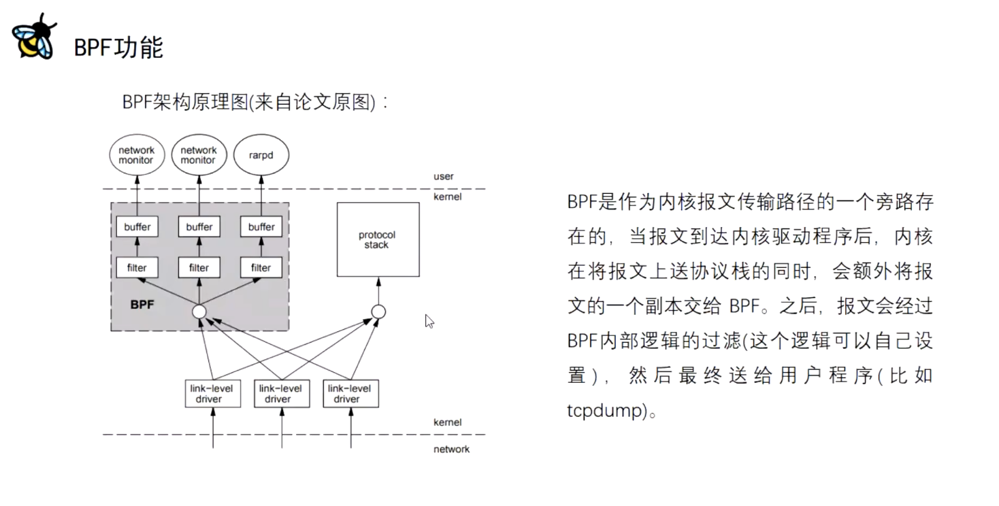
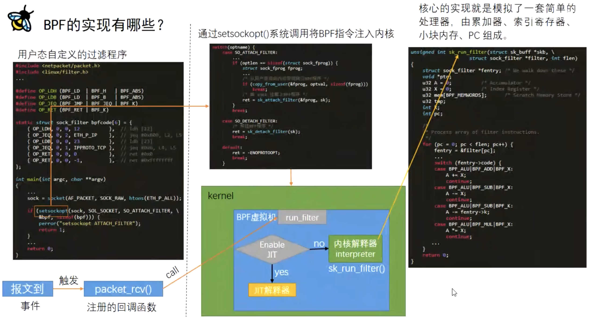

# BPF入门   

BPF 全称：Berkeley Packet Filter    

## BPF基本原理  

  

## BPF基本实现步骤  

这张图片很好的解释了BPF的基本原理，我们熟悉的TcpDump抓包工具也是基于BPF来实现的。--- https://www.cnblogs.com/xzkzzz/p/16003087.html     

    

首先在用户态写好自定义的过滤程序，然后通过setsocket()这个系统调用   

将我们定义好的过滤程序注入内核（放进内核代码），然后被动地等待事件触发。   

等报文到了以后事件触发，调用事先注册好的packet_rcv()回调函数。  

BPF虚拟机将事先注入内核代码的那段过滤程序， 

放进内核解释器interpreter【在一套简单的处理器、累加器、索引寄存器、的虚拟机环境中】解码执行。

而EBPF【Extended BPF】在BPF的基础上有更多的事件触发类型，具有更广泛的应用场景（BPF--更多应用于网络包过滤），功能更多。