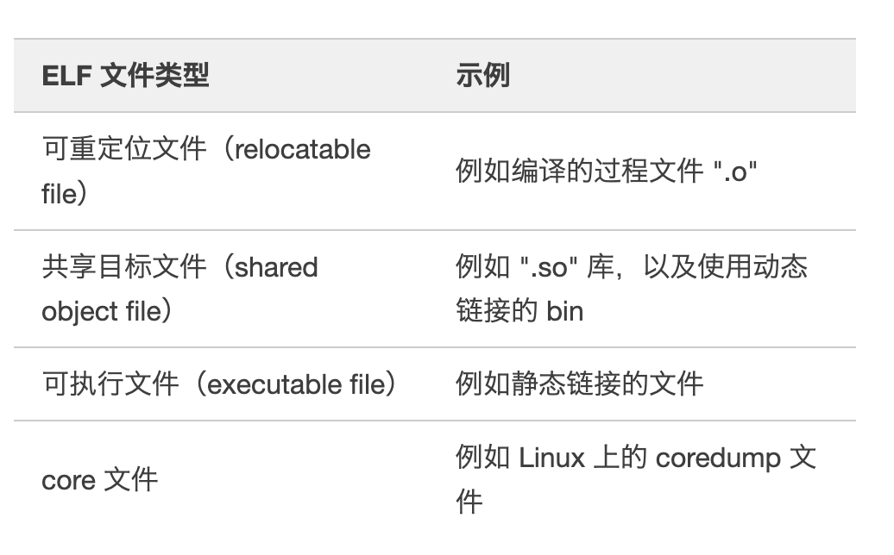
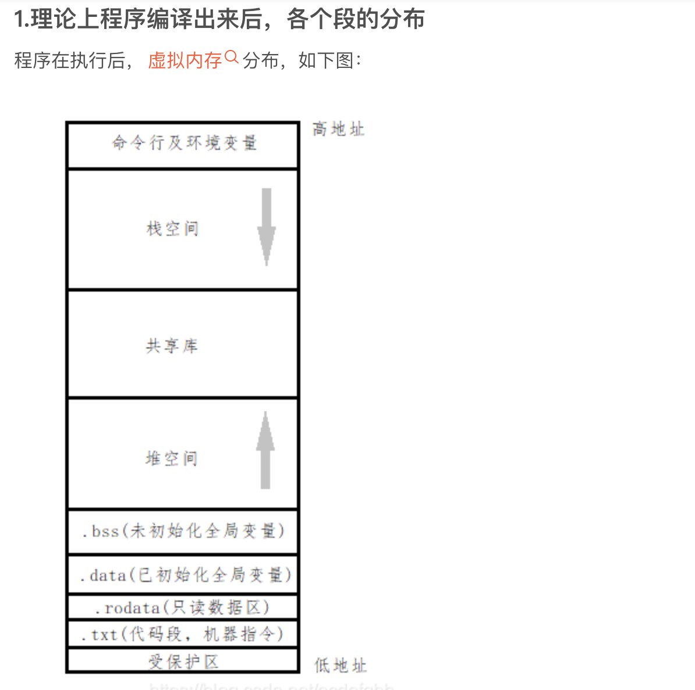
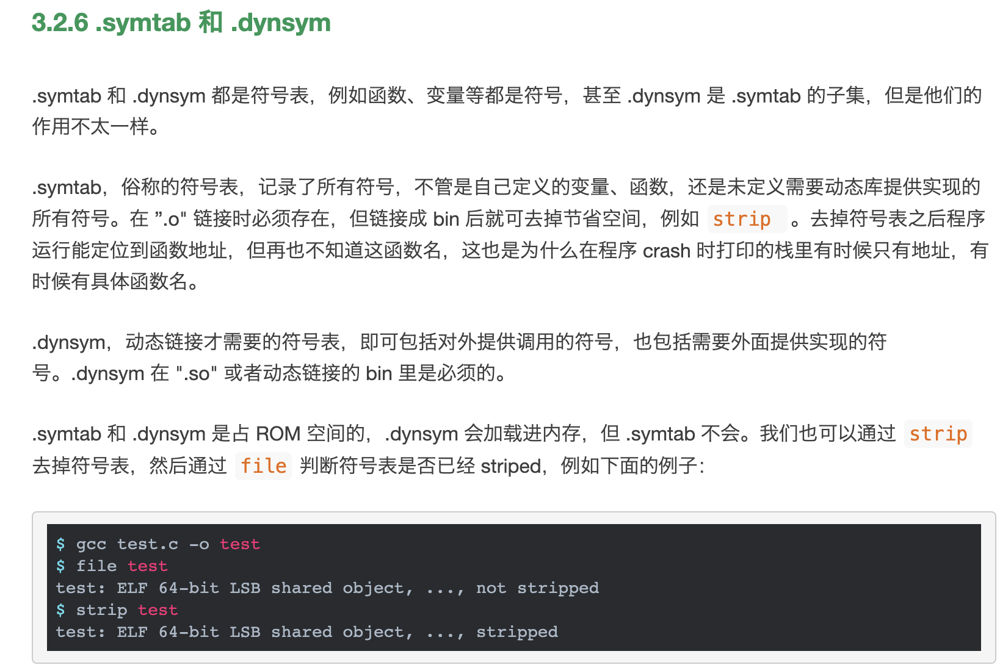

# ELF文件学习   

## 什么是ELF文件    

ELF 的全称是 Executable and Linking Format，即“可执行可连接格式”，通俗来说，就是二进制程序。    

ELF 规定了这二进制程序的组织规范，所有以这规范组织的文件都叫 ELF 文件。ELF 文件有以下四类.  

首先理论上程序编译出来后，各个段的分布  --- [段分布简短介绍博客链接](https://blog.csdn.net/acdefghb/article/details/106209103)  

      

[资料来源-博客链接](https://www.eet-china.com/mp/a169493.html)  

