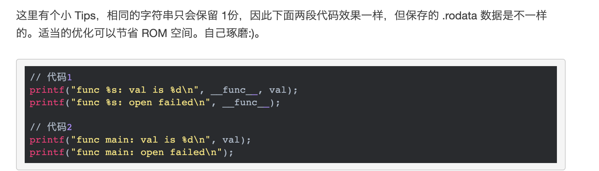

# ELF文件学习   

## 什么是ELF文件    

ELF 的全称是 Executable and Linking Format，即“可执行可连接格式”，通俗来说，就是二进制程序。    

ELF 规定了这二进制程序的组织规范，所有以这规范组织的文件都叫 ELF 文件。ELF 文件有以下四类.  


首先理论上程序编译出来后，各个段的分布  --- [段分布简短介绍博客链接](https://blog.csdn.net/acdefghb/article/details/106209103)  

      

**实习任务中使用到的技术原理，读写相关动态库ELF格式下的.rodata只读数据段，获取openssl版本号.**  

**示例如下：**  
```c
//test.c
#include<stdio.h>
int main() {
printf("hello,world");
}
``` 
```shell
root@ops-6093:~/test# gcc test.c -o test
#通过readelf工具读取
root@ops-6093:~/test# readelf -p .rodata test

String dump of section '.rodata':
  [     4]  hello,world
``` 

    

**可以在得到执行文件之后，将文件stripped,这样可以减少文件占用的磁盘空间。** 

   

```shell
root@ops-6093:~/test# file test
test: ELF 64-bit LSB pie executable, x86-64, version 1 (SYSV), dynamically linked, interpreter /lib64/ld-linux-x86-64.so.2, BuildID[sha1]=e7ee9eff2f2a9fc6d3ffcf751b1eba73a97f792a, for GNU/Linux 3.2.0, not stripped

root@ops-6093:~/test# ls -lh test
-rwxr-xr-x 1 root root 16K Feb 18 06:47 test

root@ops-6093:~/test# strip test

root@ops-6093:~/test# file test
test: ELF 64-bit LSB pie executable, x86-64, version 1 (SYSV), dynamically linked, interpreter /lib64/ld-linux-x86-64.so.2, BuildID[sha1]=e7ee9eff2f2a9fc6d3ffcf751b1eba73a97f792a, for GNU/Linux 3.2.0, stripped

root@ops-6093:~/test# ls -lh test
-rwxr-xr-x 1 root root 15K Feb 18 06:50 test
```     

**文件大小从16k减小到15k**  

[资料来源-博客链接](https://www.eet-china.com/mp/a169493.html)  

