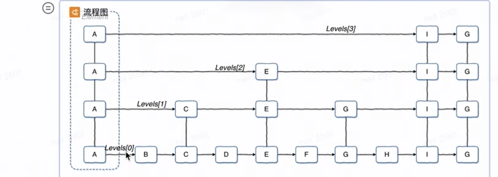

  

```
package main

type Node struct {
    data int
    next *Node
}

type Element struct {
    data KV //真正的数据
    levels []*Element   //存放节点   
}


var ElemA *Element
var ElemB *Element
var ElemC *Element
var ElemE *Element
var ElemI *Element

func init() {
    ElemA.levels[0] = ElemB
    ElemA.levels[1] = ElemC
    ElemA.levels[2] = ElemE
    ElemA.levels[3] = ElemI
}

```