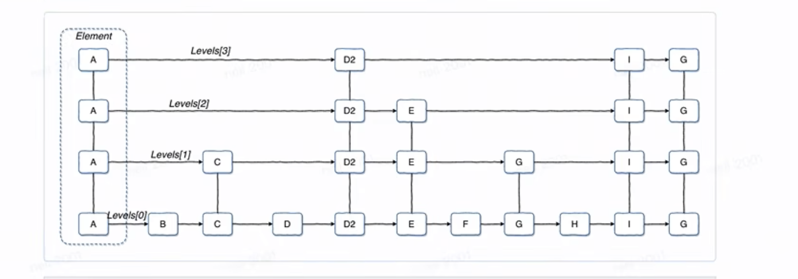
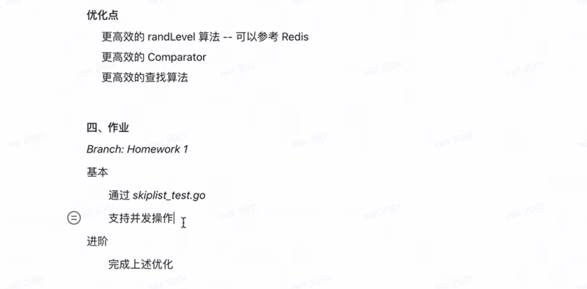

# 跳表实现  

  

**跳表初始化**  

```go
package main

type Node struct {
    data int
    next *Node
}

type Element struct {
    data KV //真正的数据
    levels []*Element   //存放节点   
}


var ElemA *Element
var ElemB *Element
var ElemC *Element
var ElemE *Element
var ElemI *Element

func init() {
    ElemA.levels[0] = ElemB
    ElemA.levels[1] = ElemC
    ElemA.levels[2] = ElemE
    ElemA.levels[3] = ElemI
}

```

**有序单链表的查找**    

```go
curNode := nil
prevNode := nil

for curNode := head.next; curNode != nil; curNode = prevNode.next {
    if key > curNode.data {
        prevNode = curNode;
        continue;
    }
    if key <= curNode.data {
        if key == curNode.data {
            return curNode.data
        }
        break;
    }
}

return notFound
```

**查找整个跳表**   

```go
prevElem := list.header
i := len(list.header.levels) - 1

for i >= 0 {
    //在每一层执行有序单链表的查找，查找终止的条件是, nextElement > findKey
    //这个位置说明改值不存在，或者是该值应该被插入的位置
    for next := prevElem.levels[i]; next != nil; next = prevElem.levels[i] {
        if findKey <= next.key {
            return next.data
        }
        break
    }
    i--
}
return notFound

```

**加速查找**    

```go
// 把全长的key字符比较，转换成八位的比较，如果还是相等才进行真正的compare比较运算。
// 能在一定程度上加速比较key过程。
func compare(score float64, key []byte, next *Element) int {
    if score == next.score {
        return bytes.Compare(key, next.entry.Key)
    }

    if score < next.score {
        return -1
    } else {
        return 1
    }
}

func calcScore(key []byte) (score float64) {
    var hash uint64 
    l := len(key)

    if l > 8 {
       l = 8
    }
    
    for i := 0; i < l; i++ {
        shift := uint(64 - 8 - i*8)
        hash |= uint64(key[i]) << shift
    }

    score = float64(hash)
    return
}
```

```go
var newNode *Node

newNode.next = next
preNode.next = newNode

//----------------------------------------
prevElem := list.header
i := len(list.header.levels) - 1
prevElemList []*Element

for i >= 0 {

}


```

**新节点要每层插入**    

    

```go
var d2 *Element

var prevElem []*Element

prevElem[3] = ElemA
prevElem[2] = ElemA
prevElem[1] = Elemc
prevElem[0] = ElemD

//node.next
d2.levels[3] = prevElem[3].levels[3]
de.levels[2] = prevElem[2].levels[2]
d2.levels[1] = prevElem[1].levels[1]
d2.levels[0] = prevElem[0].levels[0]
//d2.levels[i] = prevElem[i].levels[i]

//prevNode.next
prevElem[3].levels[3] = d2
prevElem[2].levels[2] = d2
prevElem[1].levels[1] = d2
prevElem[0].levels[0] = d2

//prevElem[i][i] = d2
```

**新节点要插入多少层，概率函数实现**    

```go
func randlevel() int {
    i := 1
    for ; i < list.maxlevel; i++ {
        if Rand(2) == 0 {
            return i
        }
    }
    return i
}

```

**结合起来实现插入操作**    

```go 
func (list *SkipList) Add(data *codec.Entry) error {
    score := list.calcScore(data.key)
    var elem *Element

    max := len(list.header.levels)
    prevElem := list.header

    var prevElemHeader [defaultMaxlevel]*Element

    for i := max - 1; i >= 0; {
        //keep visit path here
        prevElemHeader[i] = prevElem

        for next := prevElem.levels[i]; next != nil; next = prevElem.levels[i] {
            if comp := list.compare(score, data.Key, next); comp <=0 {
                if comp == 0{
                    elem = next
                    elem.entry = data
                    return nil
                }
                // find the insert position
                break
            }
            // just like linked-list next
            prevElem = next
            prevElemHeaders[i] = prevElem
        }
    }

    level := list.randLevel()

    elem = newElement(score, data, level)
    // to add elem to the skiplist
    for i := 0; i < level; i++ {
        elem.levels[i] = prevElemHeaders[i].levels[i]
        prevElemHeaders[i].levels[i] = elem
    }
    return nil
}

```

**查找操作**    

```go
func (list *SkipList)Search(key []byte) (e *codec.Entry) {
    if list.length == 0 {
        return nil
    }

    score := list.calcScore(key)

    prevElem := list.header
    i := len(list.header.levels) - 1

    for i >= 0 {
        for next := prevElem.levels[i]; next != nil; next = prevElem.levels[i] {
            if comp := list.compare(score, key, next); comp <= 0 {
                if comp == 0 {
                    return next.Entry()
                }
                break
            }

            prevElem = next
        }
    }
    return 
}

```

待完成 --   




