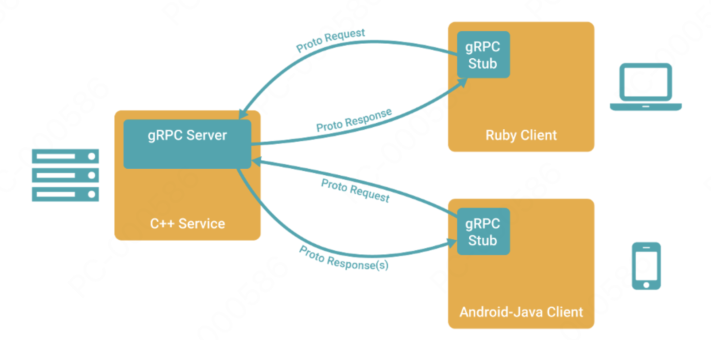
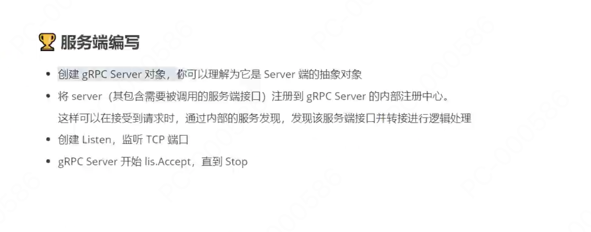

# GRPC

## 什么是GRPC?

在 gRPC 里客户端应用可以像调用本地对象一样直接调用另一台不同的机器上服务端应用的方法，  

使得您能够更容易地创建分布式应用和服务。    

与许多 RPC 系统类似，gRPC 也是基于以下理念：    

定义一个服务，指定其能够被远程调用的方法（包含参数和返回类型）。    

在服务端实现这个接口，并运行一个 gRPC 服务器来处理客户端调用。  

在客户端拥有一个存根能够像服务端一样的方法。    

  

## 使用 protocol buffers    

gRPC 默认使用 protocol buffers，    

这是 Google 开源的一套成熟的结构数据序列化机制（当然也可以使用其他数据格式如 JSON）。   

正如你将在下方例子里所看到的，你用 proto files 创建 gRPC 服务， 

用 protocol buffers 消息类型来定义方法参数和返回类型。  

## proto文件语法    

项目实际代码    

```proto
// 使用proto3版本
syntax = "proto3";

// proto文件包名
package chaitin.cloudwalker.proto.vigilcore;

option go_package = "/proto";  
// 生成的go/cpp/rust文件存放的路径，grpc文件存放的路径

// 引入外部的包
import "google/protobuf/timestamp.proto";
import "google/protobuf/empty.proto";

// message 关键字类似于struct 结构体
message YaraClientConfig {
    string socket_path = 1;
    string yara_timeout = 2;
    string cwengine_timeout = 3;
    string disable_callgraph = 4;
}

message FileInputInfo {
    string file_path = 1;
    bool avira_engine = 2;
    bool yara_engine = 3;
}

message FileScanResult {
    // oneof类似联合体,选择其中之一
    oneof scan_results {
        // 类似空值 NULL
        google.protobuf.Empty no_scan_results = 1; // 表示没有扫描结果
        AviraScanResultList avira_scan_results = 2;
        YaraScanResultList yara_scan_results = 3;
    }
}

message AviraScanResult {
    string name = 1;
    string malware_name = 2;
    string malware_info = 3;
    string malware_type = 4;
    bool removable = 5;
}

message AviraScanResultList {
    enum ScanStatus {
        Clean = 0;
        Infected = 1;
        Suspicious = 2;
        Error = 3;
        Finished = 4;
    }
    ScanStatus overall_status = 1;
    // 数组 []list 列表
    repeated AviraScanResult results = 2;
}

// message YaraVersion {
//     string engine_name = 1;
//     string version = 2;
// }

// message YaraMeta {
//     string engine_name = 1;
// }

// message YaraRuleSetResult {
//     bool success = 1;
// }

message YaraScanResult {
    uint32 risk_level = 1;
    string type = 2;
    string sub_type = 3;
    string name = 4;
    string file = 5;
    string reason = 6;
    string reason_en = 7;
}

message YaraScanResultList {
	google.protobuf.Timestamp time_cost = 1; 
	repeated YaraScanResult results = 2;
}

// service [关键字] 服务名
service ScanFile {
    // rpc [类似于 golang的func关键字] 函数名 (入参) returns (返回值) {} 
    rpc ScanFile(FileInputInfo) returns (FileScanResult) {}
}

```


## 实际使用grpc

    

proto文件:
```proto 
//这是在说明我们使用的是proto3语法
syntax = "proto3";

// 这部分的内容是关于最后生成的go文件是处于哪个目录哪个包中，.代表在当前目录生成，service代表了生成的go文件的包名是service
option go_package = ".;service";

// 然后我们需要定义一个服务，在这个服务中需要有一个方法，这个方法可以接受客户端的参数，再返回服务端的响应。
// 其实很容易可以看出，我们定义了一个service,称为SayHello,这个服务有一个rpc方法，名为SayHello.
// 这个方法会发送一个HelloRequest,然后返回一个HelloResponse。
service SayHello {
    rpc SayHello(HelloRequest) returns (HelloResponse) {}
}

// message 关键字，其实你可以理解成Golang的结构体。
// 这里比较特别的是变量后面的“赋值”。注意：这里并不是赋值，而是在定义这个变量在这个message中的位置。
message HelloRequest {
    string requestName = 1;
    int64 age = 2;
    repeated string name = 3; //在go代码中被认为是切片
}

message HelloResponse {
    string reponseMsg = 1;
}

```

服务端文件
```golang 
package main

import (
	"context"
	"fmt"
	"go/format"
	"net"
	pb "root/grpc_go/hello-server/proto"

	"google.golang.org/grpc"
)

// hello-server
type server struct {
	pb.UnimplementedSayHelloServer 
}

func (s *server) SayHello(ctx context.Context, req *pb.HelloRequest) (*pb.HelloResponse, error) {
	return &pb.HelloResponse{ResponseMsg:"hello"+req.RequestName}, nil
}

func main() {
	// 开启端口
	listen,_ := net.Listen("tcp", ":9090");
	// 创建grpc服务
	grpcServer := grpc.NewServer()
	// 在grpc服务端中去注册我们自己编写的服务
	pb.RegisterSayHelloServer(grpcServer, &server{})

	// 启动服务
	err := grpcServer.Serve(listen)
	if err != nil {
		fmt.Printf("failed to serve: %v", err)
		return
	}
}

```

客户端文件：
```golang 
package main

import (
	"context"
	"log"
	"fmt"
	pb "root/grpc_go/hello-server/proto"

	"google.golang.org/grpc"
	"google.golang.org/grpc/credentials/insecure"
)

func main() {
	// 连接到server端，此处禁用安全传输，没有加密和验证
	conn, err := grpc.Dial("127.0.0.1:9090", grpc.WithTransportCredentials(insecure.NewCredentials()))
	if err != nil {
		log.Fatal("did not connect: %v", err)
	}
	defer conn.Close()

	// 建立连接
	pb.NewSayHelloClient(conn)

	// 执行rpc调用 (这个方法在服务器端来实现并返回结果)
	resp, _ := client.SayHello(context.Background(), &pb.HelloRequest{RequestName: "jwz"})

	fmt.Println(resp.GetResponseMsg())
}

```