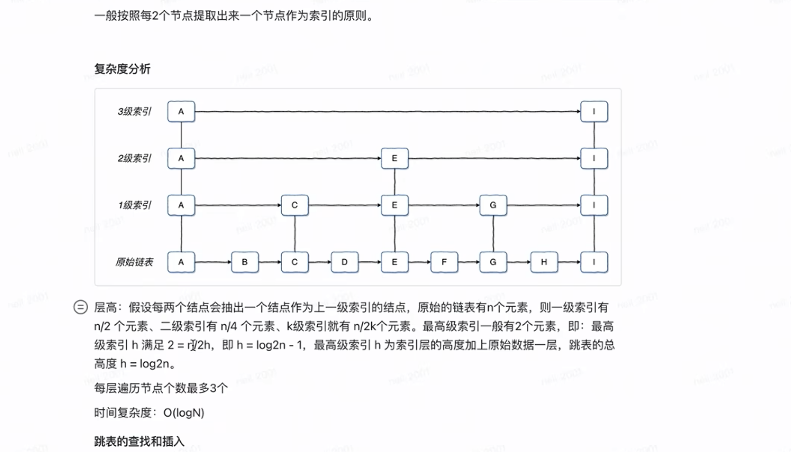
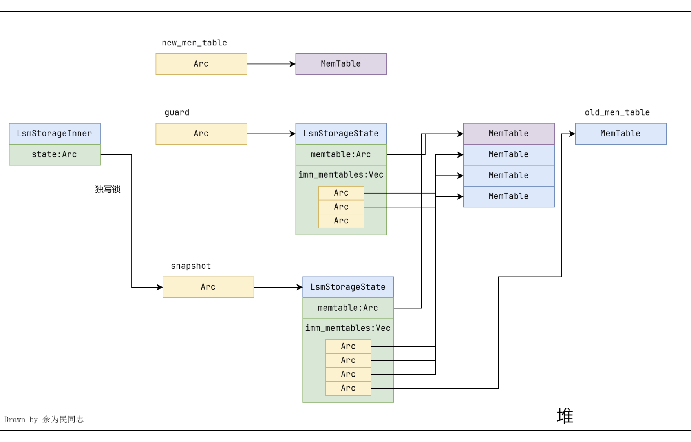

## Task1 :

memtable -> skipmap -> skiplist 

基于跳表实现的内存表    



使用 crossbeam-skiplist 作为 LSM 存储引擎的内存表（memtable）实现，确实有其独特的优势，特别是在并发读写方面。   

你提到它只需要不可变引用来进行修改操作（如插入），这背后有几个重要的设计原理和优点：    

### 1. 无锁并发设计   
crossbeam-skiplist 的设计核心是支持高效的并发读写操作，而不需要互斥锁（Mutex 或 RwLock）。它是通过无锁算法（lock-free 或 wait-free 算法）实现的。具体来说： 

跳表（Skip List）结构：跳表是一种多层链表结构，每一层都可以加速查找过程。这种结构允许在不同层进行独立的操作，从而减少竞争。 

原子操作：所有修改操作（如插入、删除）都通过原子操作来完成，确保线程安全而无需显式的锁。    

### 2. 不可变引用的安全性 
虽然从语义上看，插入操作似乎需要修改数据结构，但在 crossbeam-skiplist 中，插入操作实际上是通过原子操作来完成的。这意味着：  

插入操作：插入新节点时，crossbeam-skiplist 使用 CAS（Compare-And-Swap）等原子指令来更新指针，而不是直接修改现有节点的数据。这些操作可以在不持有可变引用的情况下安全地完成。 

一致性：由于所有修改都是通过原子操作完成的，读取操作可以继续使用不可变引用，而不必担心数据不一致的问题。即使在插入过程中，读取操作也能看到一个一致的状态。  

### 3. 性能优势   
使用不可变引用进行插入操作带来的性能优势显著：  

避免锁开销：互斥锁（Mutex 或 RwLock）会导致线程阻塞或等待，特别是在高并发场景下。无锁设计避免了这些开销，提高了系统的吞吐量。 

减少竞争：多个线程可以同时执行插入操作，而不会相互干扰。这对于高并发的键值存储系统尤为重要。    

### 4. API 设计简化
由于 crossbeam-skiplist 的设计允许只用不可变引用来进行插入操作，这使得 API 设计更加简洁和直观。开发者不需要考虑复杂的锁机制，代码也更易于理解和维护。   

## 总结：
**crossbeam-skiplist 只需要不可变引用进行插入操作的原因在于它的无锁并发设计。**    

**通过使用原子操作和跳表结构，它能够在不持有可变引用的情况下安全高效地进行插入和其他修改操作。**    

**这不仅提升了性能，还简化了并发编程的复杂度，非常适合高性能的键值存储系统如 LSM 存储引擎的 memtable 实现。**       

**如果你在实现 memtable 时遵循这一设计原则，不仅可以避免不必要的锁开销，还能充分利用 Rust 的并发特性，构建一个高效且线程安全的内存表结构。**  

**CAS-原子操作** -- [博客链接](https://blog.csdn.net/mhz2977170/article/details/134019646)

**冻结原有的内存表（取代之前的cur_mem_table），创建新内存表，更新内存表列表，并且等待持久化到磁盘【非阻塞】。** 



```rust
// Put a key-value pair into the storage by writing into the current memtable. 
pub fn put(&self, _key: &[u8], _value: &[u8]) -> Result<()> { 
    { 
        let guard = self.state.read(); 
        let _ = guard.memtable.put(_key, _value); 
        if guard.memtable.approximate_size() >= self.options.target_sst_size 
        { 
            let state_lock = self.state_lock.lock(); 
            if guard.memtable.approximate_size() >= self.options.target_sst_size 
            { 
                self.force_freeze_memtable(&state_lock)?; 
            } 
        }
    } 
    Ok(())
} 
//这份代码为什么会超时
```
**在 put 方法中，你首先获取了 self.state 的读锁，然后在 if 条件成立时尝试获取 self.state_lock 的写锁。这可能会导致锁竞争，尤其是在高并发的情况下。如果多个线程同时到达 if 条件并尝试获取 self.state_lock，可能会导致其中一个线程长时间等待，从而引发超时。**    

**这份代码教会我们，注意锁的机制，读写锁的读锁是共享的，写锁是独占的，前期读锁读到信息以后及时释放，否则会和死锁形成竞争**  

**正确写法:**   

```rust
/// Put a key-value pair into the storage by writing into the current memtable.
    pub fn put(&self, _key: &[u8], _value: &[u8]) -> Result<()> {
        let mut needs_freeze = false;
        {
            let guard = self.state.read();
            guard.memtable.put(_key, _value);
            let memtable_size = guard.memtable.approximate_size();
            if guard.memtable.approximate_size() >= self.options.target_sst_size {
                needs_freeze = true;
            }
        }

        if needs_freeze {
            let state_lock = self.state_lock.lock();
            self.force_freeze_memtable(&state_lock);
        }

        Ok(())
    }

``` 

```