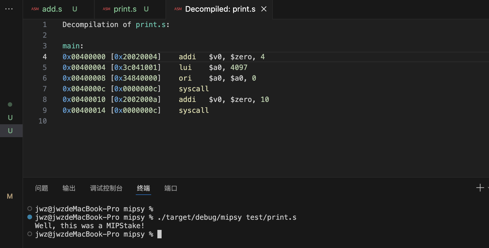

# MIPS

```asm
Decompilation of print.s:

main: 
0x00400000 [0x20020004]    addi   $v0, $zero, 4
0x00400004 [0x3c041001]    lui    $a0, 4097
0x00400008 [0x34840000]    ori    $a0, $a0, 0
0x0040000c [0x0000000c]    syscall 
0x00400010 [0x2002000a]    addi   $v0, $zero, 10
0x00400014 [0x0000000c]    syscall
```



```asm
.data
    # 定义要打印的字符串
    message: .asciiz "Well, this was a MIPStake!\n"

.text
    # 主程序入口
    .globl main

main:
    # 将 $a0 寄存器设置为 1，因为 printf 返回值通过 $a0 返回
    li $v0, 4          # 加载系统调用号 4 到 $v0（print_string）
    la $a0, message    # 将字符串地址加载到 $a0
    syscall            # 调用系统调用打印字符串

    # 返回 0
    li $v0, 10         # 加载系统调用号 10 到 $v0（exit）
    syscall            # 调用系统调用退出程序
```

## 字节对齐

在计算机系统中，“4字节对齐”是指数据在内存中的起始地址必须是4的倍数。    

这种对齐方式通常用于提高处理器访问数据的效率。大多数现代处理器在访问内存时对齐的数据比未对齐的数据更快。    

**为什么需要4字节对齐？**   

性能：处理器在访问内存时通常会更快地处理对齐的数据。未对齐的数据访问可能导致额外的内存访问操作，从而降低性能。  

兼容性：某些硬件架构要求数据必须按特定的边界对齐。未对齐的数据访问可能导致硬件异常或错误。  

**如何实现4字节对齐？**

在MIPS汇编语言中，可以使用 .align 指令来确保数据按指定的字节边界对齐。例如：

```asm
.data
f: .asciiz "hello"
   .align 2
g: .space 4
```

在这个例子中，.align 2 指令确保 g 变量从一个4字节对齐的地址开始。具体来说：

f 是一个字符串 "hello"，占用6个字节（5个字符加上一个空字符）。  

.align 2 指令会使下一个数据对象（即 g）的地址对齐到4字节边界。  

假设当前地址为0x1000，那么：    

f 从地址0x1000开始，占用6个字节，结束于0x1005。 

.align 2 会跳过接下来的3个字节（从0x1006到0x1008），使下一个数据对象从0x1008开始。  

g 从地址0x1008开始，占用4个字节。   

因此，g 的起始地址0x1008是一个4字节对齐的地址。 
