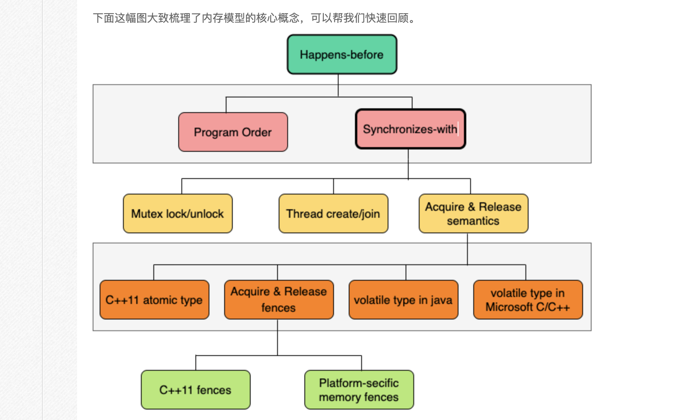

# 内存序    
  

写在前面    
在真正了解Memory Model的作用之前，曾经简单地将Memory Order等同于mutex和atomic来进行线程间数据同步，或者用来限制线程间的执行顺序，其实这是一个错误的理解。直到后来仔细研究了Memory Order之后，才发现无论是功能还是原理，Memory Order与他们都不是同一件事。实际上，Memory Order是用来用来约束同一个线程内的内存访问排序方式的，虽然同一个线程内的代码顺序重排不会影响本线程的执行结果（如果结果都不一致，那么重排就没有意义了），但是在多线程环境下，重排造成的数据访问顺序变化会影响其它线程的访问结果。 

正是基于以上原因，引入了内存模型。C++的内存模型解决的问题是如何合理地限制单一线程中的代码执行顺序，使得在不使用锁的情况下，既能最大化利用CPU的计算能力，又能保证多线程环境下不会出现逻辑错误。  

指令乱序
现在的CPU都采用的是多核、多线程技术用以提升计算能力；采用乱序执行、流水线、分支预测以及多级缓存等方法来提升程序性能。多核技术在提升程序性能的同时，也带来了执行序列乱序和内存序列访问的乱序问题。与此同时，编译器也会基于自己的规则对代码进行优化，这些优化动作也会导致一些代码的顺序被重排。   

首先，我们看一段代码，如下：    

```c
int A = 0;
int B = 0;

void fun() {
    A = B + 1; // L5
    B = 1; // L6
}

int main() {
    fun();
    return 0;
}
```

如果使用 g++ test.cc，则生成的汇编指令如下：    

```x86arm
movl    B(%rip), %eax
addl    $1, %eax
movl    %eax, A(%rip)
movl    $1, B(%rip)
```
通过上述指令，可以看到，先把B放到eax，然后eax+1放到A，最后才执行B + 1。 

而如果我们使用g++ -O2 test.cc，则生成的汇编指令如下：   

```x86asm
movl    B(%rip), %eax
movl    $1, B(%rip)
addl    $1, %eax
movl    %eax, A(%rip)
```
可以看到，先把B放到eax，然后执行B = 1，再执行eax + 1，最后将eax赋值给A。从上述指令可以看出执行B赋值(语句L6)语句先于A赋值语句(语句L5)执行。  

我们将上述这种不按照代码顺序执行的指令方式称之为指令乱序。  

对于指令乱序，这块需要注意的是：编译器只需要保证在单线程环境下，执行的结果最终一致就可以了，所以，指令乱序在单线程环境下完全是允许的。对于编译器来说，它只知道：在当前线程中，数据的读写以及数据之间的依赖关系。但是，编译器并不知道哪些数据是在线程间共享，而且是有可能会被修改的。而这些是需要开发人员去保证的。  


[内存序博客链接](https://www.cnblogs.com/gaoxingnjiagoutansuo/p/16383137.html)