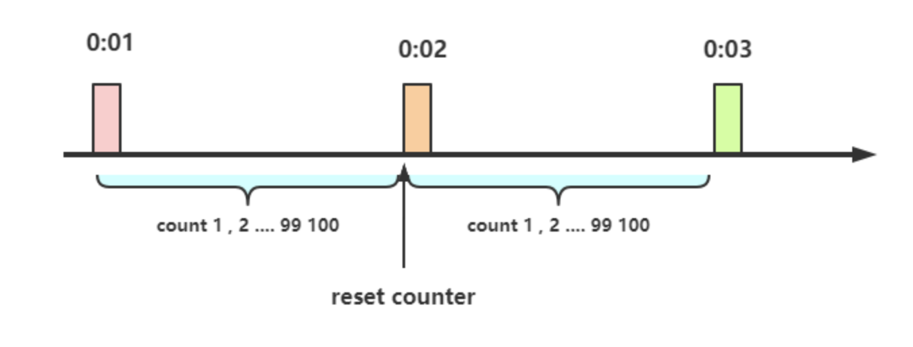
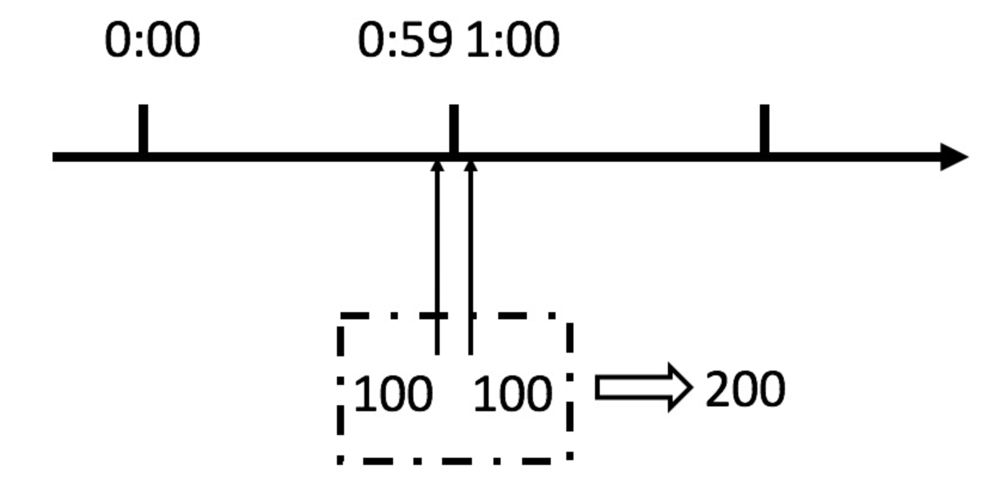

# 限流  

**限流的思想**  

**|在保证可用的情况下尽可能多增加进入的人数,其余的人在排队等待,或者返回友好提示,保证里面的进行系统的用户可以正常使用，防止系统雪崩|**   

## 限流的算法

限流的手段通常有计数器、漏桶、令牌桶。注意限流和限速（所有请求都会处理）的差别，视
业务场景而定。

### 计数器：

在一段时间间隔内（时间窗/时间区间），处理请求的最大数量固定，超过部分不做处理。 

简单粗暴,比如指定线程池大小，指定数据库连接池大小、nginx连接数等,这都属于计数器算法。   

计数器算法是限流算法里最简单也是最容易实现的一种算法。  

举个例子,比如我们规定对于A接口，我们1分钟的访问次数不能超过100个。  

那么我们可以这么做：    

在一开 始的时候，我们可以设置一个计数器counter，每当一个请求过来的时候，counter就加1，如果counter的值大于100并且该请求与第一个请求的间隔时间还在1分钟之内，那么说明请求数过多,拒绝访问；    

如果该请求与第一个请求的间隔时间大于1分钟，且counter的值还在限流范围内，那么就重置 counter,就是这么简单粗暴。   

  

计数器限流的问题：  

从上图中我们可以看到，假设有一个恶意用户，他在0:59时，瞬间发送了100个请求，并且1:00又瞬间发送了100个请求，那么其实这个用户在 1秒里面，瞬间发送了200个请求。 

我们刚才规定的是1分钟最多100个请求（规划的吞吐量），也就是每秒钟最多1.7个请求，用户通过在时间窗口的重置节点处突发请求， 可以瞬间超过我们的速率限制。    

### 漏桶：

漏桶大小固定，处理速度固定，但请求进入速度不固定（在突发情况请求过多时，会丢弃过多的请求）。    

漏桶算法其实很简单，可以粗略的认为就是注水漏水过程，往桶中以任意速率流入水，以一定速率流出水，当水超过桶容量（capacity）则丢弃，因为桶容量是不变的，保证了整体的速率。  

以一定速率流出水，可以看出漏桶算法能强行限制数据的传输速率。 

削峰:有大量流量进入时,会发生溢出,从而限流保护服务可用   

缓冲:不至于直接请求到服务器, 缓冲压力   

消费速度固定 因为计算性能固定   

漏桶的出水速度固定，也就是请求放行速度是固定的。    

漏桶限流的问题：    

实际上的问题：  

漏桶出口的速度固定，不能灵活的应对后端能力提升。比如，通过动态扩容，后端流量从1000QPS提升到1WQPS，漏桶没有办法。    

### 令牌桶：

令牌桶的大小固定，令牌的产生速度固定，但是消耗令牌（即请求）速度不固定（可以应对一些某些时间请求过多的情况）；每个请求都会从令牌桶中取出令牌，如果没有令牌则丢弃该次请求。

令牌桶算法以一个设定的速率产生令牌并放入令牌桶，每次用户请求都得申请令牌，如果令牌不足，则拒绝请求。 

令牌桶算法中新请求到来时会从桶里拿走一个令牌，如果桶内没有令牌可拿，就拒绝服务。    

当然，令牌的数量也是有上限的。令牌的数量与时间和发放速率强相关，时间流逝的时间越长，会不断往桶里加入越多的令牌，如果令牌发放的速度比申请速度快，令牌桶会放满令牌，直到令牌占满整个令牌桶，如图所示。    

令牌桶限流大致的规则如下：  

（1）进水口按照某个速度，向桶中放入令牌。   

（2）令牌的容量是固定的，但是放行的速度不是固定的，只要桶中还有剩余令牌，一旦请求过来就能申请成功，然后放行。   

（3）如果令牌的发放速度，慢于请求到来速度，桶内就无牌可领，请求就会被拒绝。 

总之，令牌的发送速率可以设置，从而可以对突发的出口流量进行有效的应对。  

**令牌桶的好处**    

令牌桶的好处之一就是可以方便地应对 突发出口流量（后端能力的提升）。 

比如，可以改变令牌的发放速度，算法能按照新的发送速率调大令牌的发放数量，使得出口突发流量能被处理。  

--- 学习的来源，基于百度笔试题目（手写一个限流算法）