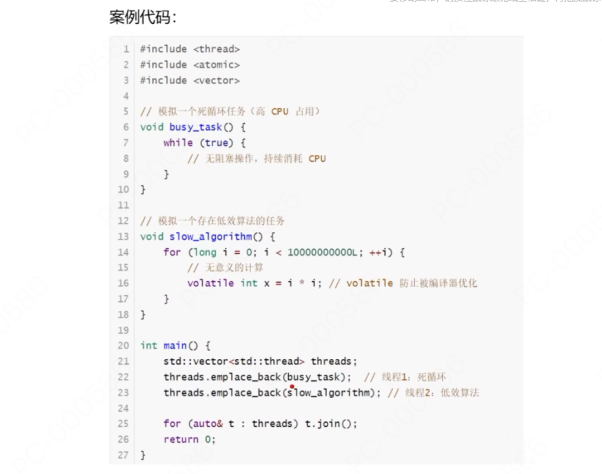

# CPU占用率高

  

## 案例代码



```cpp
#include <thread>
#include <atomic>
#include <vector>

// 模拟一个死循环任务 (高CPU占用)
void busy_task() {
    while (true) {
        // 无阻塞操作，持续消耗CPU
    }
}

// 模拟一个存在低效算法的任务
void slow_algorithm() {
    for (long i = 0; i < 10000000000L; ++i) {
        // 无意义的计算
        volatile int x = i * i; //volatile 防止呗编译器优化
    }
}

int main() {
    std::vector<std::thread> threads;
    threads.emplace_back(busy_task);    //线程1: 死循环
    threads.emplace_back(slow_algorithm); //线程2: 低效算法

    for (auto & t : threads) t.join();
    return 0;
}
``` 

## 排查步骤 

以下结合真实运行测试:

```shell
# 1.编译
g++ -g example.cpp -o example -lpthread

# 2.运行
./example

# 3.定位进程
top -c 

# 4.定位线程
top -H -p <pid>

# 5.查看线程堆栈
gdb -p <pid> -ex "thread apply all bt" -ex "detach" -ex "quit" > stack_dump.log

# 6.查看日志
cat stack_dump.log

# 7.分析并解决 


# top -> 显示系统中正在运行的进程的动态实时信息
#     -c 显示进程完整信息
#     -H 启用线程模式
#     -p 指定进程
#     -H -p 特点进程所有线程的详细信息
 
```

## 日志文件 

```shell
GNU gdb (Ubuntu 12.1-0ubuntu1~22.04.2) 12.1
Copyright (C) 2022 Free Software Foundation, Inc.
License GPLv3+: GNU GPL version 3 or later <http://gnu.org/licenses/gpl.html>
This is free software: you are free to change and redistribute it.
There is NO WARRANTY, to the extent permitted by law.
Type "show copying" and "show warranty" for details.
This GDB was configured as "x86_64-linux-gnu".
Type "show configuration" for configuration details.
For bug reporting instructions, please see:
<https://www.gnu.org/software/gdb/bugs/>.
Find the GDB manual and other documentation resources online at:
    <http://www.gnu.org/software/gdb/documentation/>.

For help, type "help".
Type "apropos word" to search for commands related to "word".
Attaching to process 2497109
Reading symbols from /root/puzzlefs/example...
Reading symbols from /usr/lib/x86_64-linux-gnu/libstdc++.so.6...
(No debugging symbols found in /usr/lib/x86_64-linux-gnu/libstdc++.so.6)
Reading symbols from /usr/lib/x86_64-linux-gnu/libgcc_s.so.1...
(No debugging symbols found in /usr/lib/x86_64-linux-gnu/libgcc_s.so.1)
Reading symbols from /usr/lib/x86_64-linux-gnu/libc.so.6...
(No debugging symbols found in /usr/lib/x86_64-linux-gnu/libc.so.6)
Reading symbols from /usr/lib/x86_64-linux-gnu/libm.so.6...
(No debugging symbols found in /usr/lib/x86_64-linux-gnu/libm.so.6)
Reading symbols from /lib64/ld-linux-x86-64.so.2...
(No debugging symbols found in /lib64/ld-linux-x86-64.so.2)
[Thread debugging using libthread_db enabled]
Using host libthread_db library "/usr/lib/x86_64-linux-gnu/libthread_db.so.1".
busy_task () at example.cpp:7
7	    while (true) {

Thread 1 (Thread 0x7febcf9b6640 (LWP 2497109) "example"):
#0  busy_task () at example.cpp:7
#1  0x0000560444b16c11 in std::__invoke_impl<void, void (*)()> (__f=@0x560445604ed8: 0x560444b152e9 <busy_task()>) at /usr/include/c++/11/bits/invoke.h:61
#2  0x0000560444b16bbd in std::__invoke<void (*)()> (__fn=@0x560445604ed8: 0x560444b152e9 <busy_task()>) at /usr/include/c++/11/bits/invoke.h:96
#3  0x0000560444b16b5e in std::thread::_Invoker<std::tuple<void (*)()> >::_M_invoke<0ul> (this=0x560445604ed8) at /usr/include/c++/11/bits/std_thread.h:259
#4  0x0000560444b16b2e in std::thread::_Invoker<std::tuple<void (*)()> >::operator() (this=0x560445604ed8) at /usr/include/c++/11/bits/std_thread.h:266
#5  0x0000560444b16b0e in std::thread::_State_impl<std::thread::_Invoker<std::tuple<void (*)()> > >::_M_run (this=0x560445604ed0) at /usr/include/c++/11/bits/std_thread.h:211
#6  0x00007febcfdc7253 in ?? () from /usr/lib/x86_64-linux-gnu/libstdc++.so.6
#7  0x00007febcfb36ac3 in ?? () from /usr/lib/x86_64-linux-gnu/libc.so.6
#8  0x00007febcfbc8850 in ?? () from /usr/lib/x86_64-linux-gnu/libc.so.6
Detaching from program: /root/puzzlefs/example, process 2497109
[Inferior 1 (process 2497109) detached]

``` 
## 实验运行截图


  

